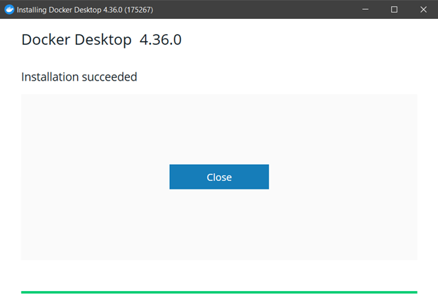
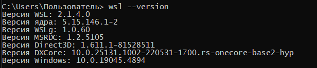
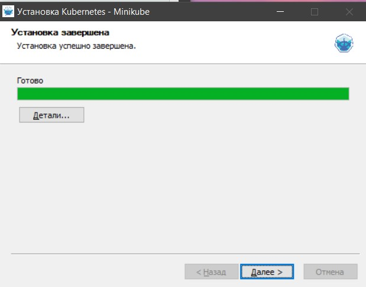
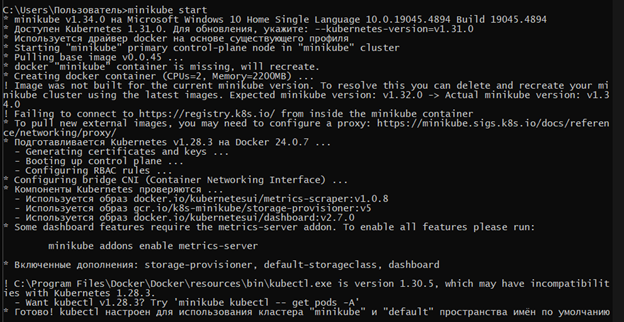
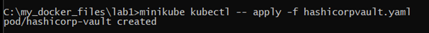
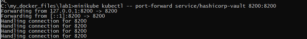
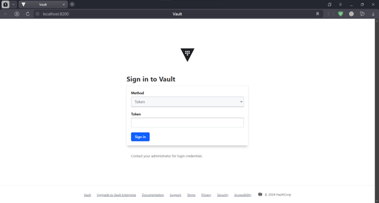
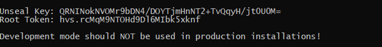
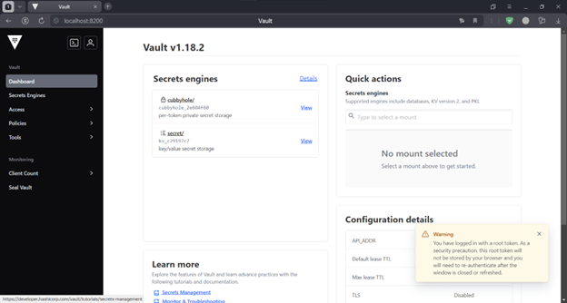
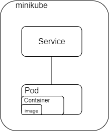

University: [ITMO University](https://itmo.ru/ru/)

Faculty: [FICT](https://fict.itmo.ru)

Course: [Introduction to distributed technologies](https://github.com/itmo-ict-faculty/introduction-to-distributed-technologies)

Year: 2024/2025

Group: K4110c

Author: Zagaynova Kristina Yuryevna

Lab: Lab1

Date of create: 07.12.2024

Date of finished: 


## Ход работы

### Установка Docker и Minikube

1. Установим Docker 




При установке докера возникли некоторые проблемы, поэтому было принято решение обновить WSL. После обновления установился Docker запустился корректно. 



2.Установим minikube 



3. Развернем minikube cluster с помомщью команды (Рисунок 4)
```
minikube start
```


3. Для первого манифеста был предложен образ HashiCorp Vault. Пропишем создание пода с образом hashicorp/vault версии 1.18.2 и укажем 8200 порт.
```
apiVersion: v1
kind: Pod
metadata:
  name: hashicorp-vault
  labels:
    app: hashicorp-vault
spec:
  containers:
  - name: hashicorp-vault
    image: hashicorp/vault:1.18.2
    ports:
    - containerPort: 8200
```

4.Создадим наш контейнер



5.Пропишем сервис для доступа к контейнеру 


6.Сделаем проброс портов, чтобы попасть на наш контейнер 



7.Перейдем по http://localhost:8200 и проверим доступ к нашему контейнеру. 



8.Чтобы зайти в vault необходимо найти токен в логах, для этого воспользуемся командой 
```
minikube kubectl -- logs hashicorp-vault
```



Проверим, что мы успешно зашли



Схема организации контейнеров и сервисов 



### Вопросы

1. Что произошло и что сделала команда, указанная ранее?
  Команды, указанные выше, развернули кластер Minikube, создали под HashiCorp Vault и предоставили возможность получить доступ к его веб-интерфейсу через сервис для взаимодействовия с Vault.

2. Где взять токен для входа в Vault?
   Токен для входа можно найти в логах пода Vault, которые выводятся с помощью команды kubectl logs vault. 


