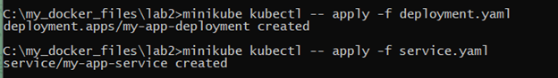
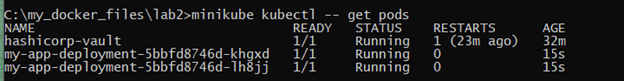
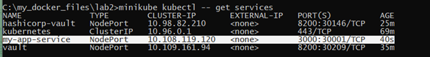
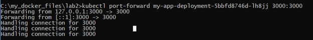
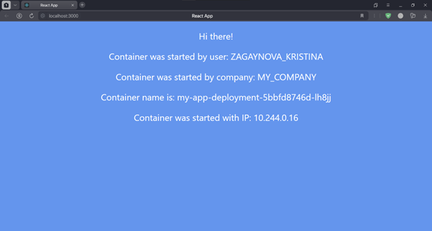
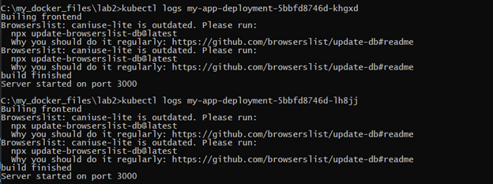
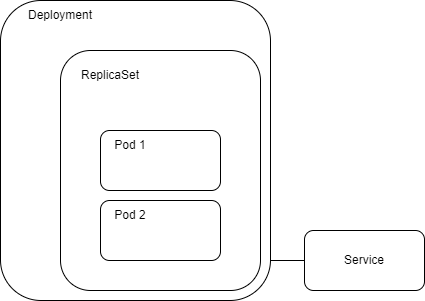

University: [ITMO University](https://itmo.ru/ru/)

Faculty: [FICT](https://fict.itmo.ru)

Course: [Introduction to distributed technologies]
(https://github.com/itmo-ict-faculty/introduction-to-distributed-technologies)

Year: 2024/2025

Group: K4110c

Author: Zagaynova Kristina Yuryevna

Lab: Lab1

Date of create: 07.12.2024

Date of finished:

## Ход работы

### Развертывание веб сервиса в Minikube, доступ к веб интерфейсу сервиса. Мониторинг сервиса

1. Создадим deployment с 2 репликами контейнера ifilyaninitmo/itdt-contained-frontend:master и передать переменные в эти реплики: REACT_APP_USERNAME, REACT_APP_COMPANY_NAME
```
apiVersion: apps/v1
kind: Deployment
metadata:
  name: my-app-deployment
spec:
  replicas: 2
  selector:
    matchLabels:
      app: my-app
  template:
    metadata:
      labels:
        app: my-app
    spec:
      containers:
      - name: my-app-container
        image: ifilyaninitmo/itdt-contained-frontend:master
        ports:
        - containerPort: 3000
        env:
        - name: REACT_APP_USERNAME
          value: ZAGAYNOVA_KRISTINA
        - name: REACT_APP_COMPANY_NAME
          value: MY_COMPANY

```
2. Создим сервис через который будет доступ на поды.

```
apiVersion: v1
kind: Service
metadata:
  name: my-app-service
spec:
  type: NodePort
  selector:
    app: my-app
  ports:
    - protocol: TCP
      port: 3000
      targetPort: 3000
      nodePort: 30001
```
3. Создадим наши поды и сервис



4.Проверим только что созданные поды и сервис





5. Запустим в minikube режим проброса портов и подключимся к контейнерам через браузер. Переменные, которые мы задали в манифесте будут неизменными и одиннаковыми. Имя контейнера изменяется в зависимости от того, какой под был запущен.





6. Посмотрим логи контейнеров.



Схема организации контейнеров и сервисов


