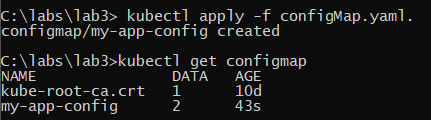
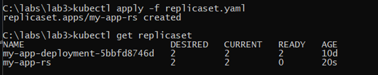
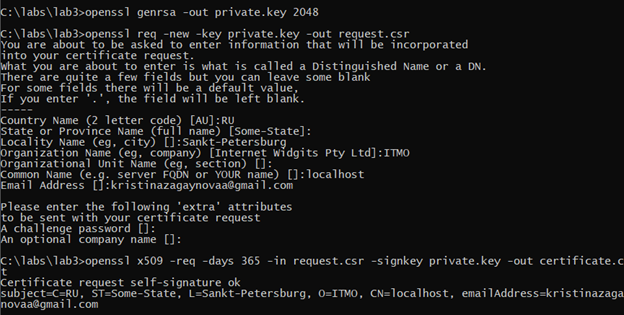
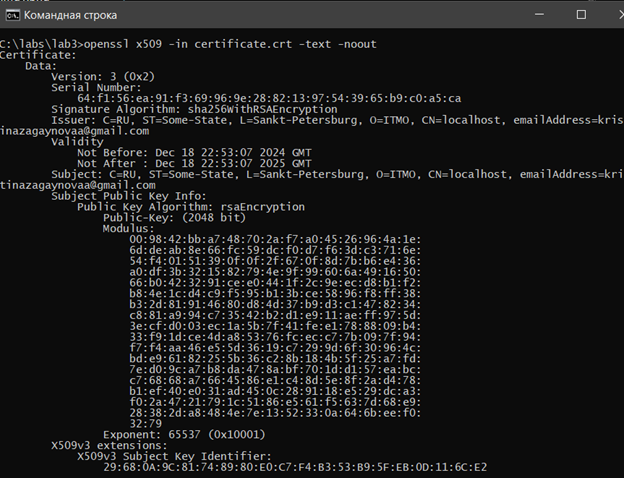
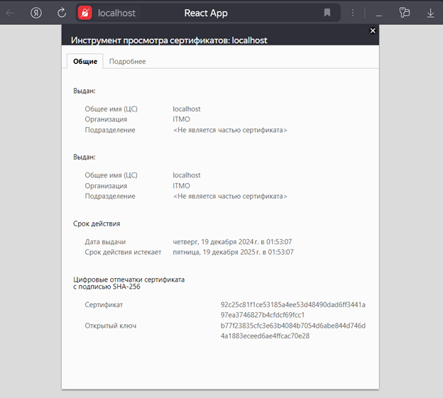
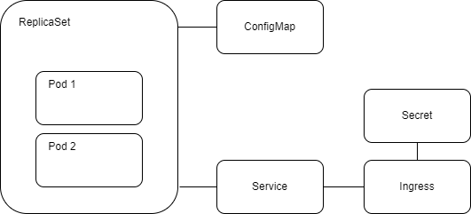

University: [ITMO University](https://itmo.ru/ru/)

Faculty: [FICT](https://fict.itmo.ru)

Course: [Introduction to distributed technologies]
(https://github.com/itmo-ict-faculty/introduction-to-distributed-technologies)

Year: 2024/2025

Group: K4110c

Author: Zagaynova Kristina Yuryevna

Lab: Lab3

Date of create: 16.12.2024

Date of finished:

## Ход работы

### Сертификаты и "секреты" в Minikube, безопасное хранение данных.

1. Создадим ConfigMap с переменными REACT_APP_USERNAME, REACT_APP_COMPANY_NAME

```
apiVersion: v1    
kind: ConfigMap     
metadata:       
name: my-app-config     
data:       
  REACT_APP_USERNAME: "ZAGAYNOVA_KRISTINA"       
  REACT_APP_COMPANY_NAME: "MY_COMPANY"     
```


2. Создадим  replicaSet с 2 репликами контейнера ifilyaninitmo/itdt-contained-frontend:master и с помощью configMap передадим переменные REACT_APP_USERNAME, REACT_APP_COMPANY_NAME.

```
apiVersion: apps/v1     
kind: ReplicaSet     
metadata:       
  name: my-app-rs     
spec:       
  replicas: 2       
  selector:        
    matchLabels:           
      app: my-app       
  template:         
    metadata:           
      labels:             
        app: my-app         
    spec:           
      containers:          
      - name: my-app-container             
        image: ifilyaninitmo/itdt-contained-frontend:master             
        env:
        - name: REACT_APP_USERNAME
          valueFrom:
              configMapKeyRef:
                name: my-app-config 
                key:  react_app_username
        - name: REACT_APP_COMPANY_NAME
          valueFrom:
              configMapKeyRef:
                name: my-app-config 
                key: react_app_company_name
        ports:
        - containerPort: 3000

```
Проверим созданый ConfigMap и ReplicaSet





3.Cгенерируем закрытый ключ с помощью команды
```
openssl genrsa -out private.key 2048
```
Эта команда создаст файл с закрытым ключом private.key.

Далее выполним команды для создания запроса на подпись сертификата (CSR):
```
openssl req -new -key private.key -out request.csr
```
И создадим самоподписанный сертификат с помощью следующей команды:
```
openssl x509 -req -days 365 -in request.csr -signkey private.key -out certificate.crt
```
Это создаст файл certificate.crt с вашим самоподписанным сертификатом, который будет действителен в течение 365 дней.



Проверим сертифкат 



3. Для импорта сертификата в minikube создадим secret

```
kubectl create secret tls my-tls-secret --cert=certificate.crt --key=private.key
```
4. Создадим сервис

```
apiVersion: apps/v1
kind: Service
metadata:
  name: my-app-service
spec:
  selector:
    app: my-app  
  ports:
  - protocol: TCP
    port: 80  
    targetPort: 3000  
  type: LoadBalancer 

```

5. Создадим ingress.yaml и включим minikube addons enable ingress

```
apiVersion: networking.k8s.io/v1
kind: Ingress
metadata:
  name: my-ingress
spec:
  tls:
  - hosts:
    - localhost
    secretName: my-tls-secret 
  rules:
  - host: localhost  
    http:
      paths:
      - path: /        
        pathType: Prefix
        backend:
          service:
            name: my-app-service 
            port:
              number: 80  

```
6.После создания Ingress запустим inikube tunnel, чтобы пробросить подключение к Ingress и проверим доступ к нашему приложению через браузер




Схема организации контейнеров и сервисов


