University: [ITMO University](https://itmo.ru/ru/)

Faculty: [FICT](https://fict.itmo.ru)

Course: [Introduction to distributed technologies]
(https://github.com/itmo-ict-faculty/introduction-to-distributed-technologies)

Year: 2024/2025

Group: K4110c

Author: Zagaynova Kristina Yuryevna

Lab: Lab4

Date of create: 21.12.2024

Date of finished:

## Ход работы

### Сети связи в Minikube, CNI и CoreDNS

1. Запустим minikube с подключенным плагином CNI=calico, режимом работы Multi-Node Clusters и двумя нодами

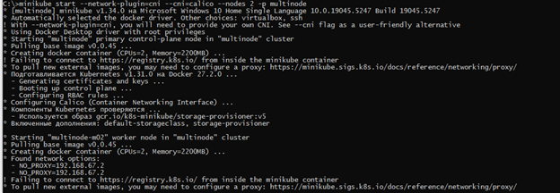

2. Проверим наличие двух нод 

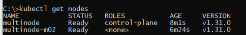

3. Для проверки работы  CNI Calico проверим количество подов с меткой calico-node

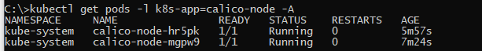

4. Назначим лейблы нодам с помощью команд: 

```
kubectl label nodes multinode rack=0
kubectl label nodes multinode-m02 rack=1
```
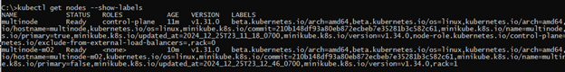

5. Установим **calicoctl** 

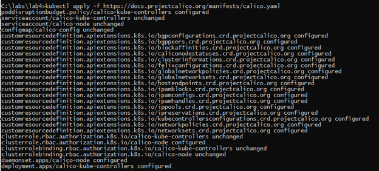

6. Создадим манифест для  IPPool

```
apiVersion: projectcalico.org/v3
kind: IPPool
metadata:
  name: rack-0-ippool
spec:
  cidr: 192.168.224.0/24
  ipipMode: Always
  natOutgoing: true
  nodeSelector: rack == "0"
---
apiVersion: projectcalico.org/v3
kind: IPPool
metadata:
  name: rack-1-ippool
spec:
  cidr: 192.168.225.0/24
  ipipMode: Always
  natOutgoing: true
  nodeSelector: rack == "1"
```
7. Создадим IPPool 

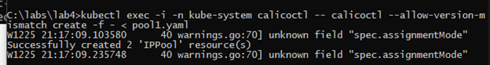

8. Создадим deployment и Servive для развертывания

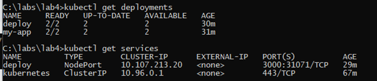

9.Проверяем IP созданных Pod'ов: 
```
kubectl get pods -o wide.
```

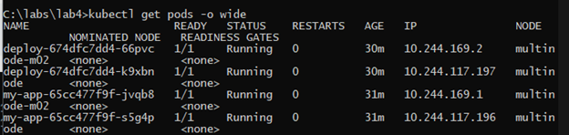

10.Пробрасываем порт для подключения к сервису через браузер и проверим доступность


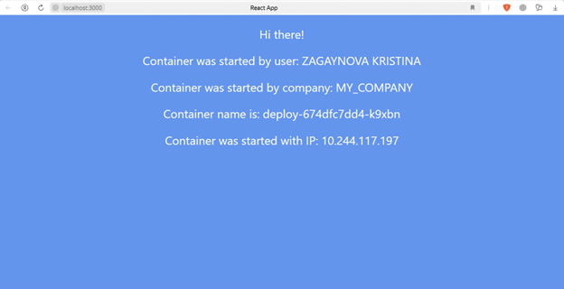

Переменные Container name и Container IP могут меняться, в зависимости от пода, но соотвествуют созданным IPPool.

12. Сделаем проверочный пинг с одного контейнера на другой 

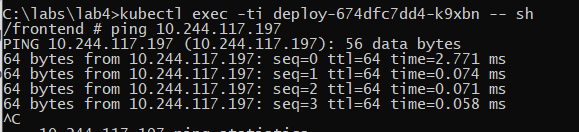

Схема организации контейнеров и сервисов

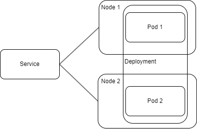
